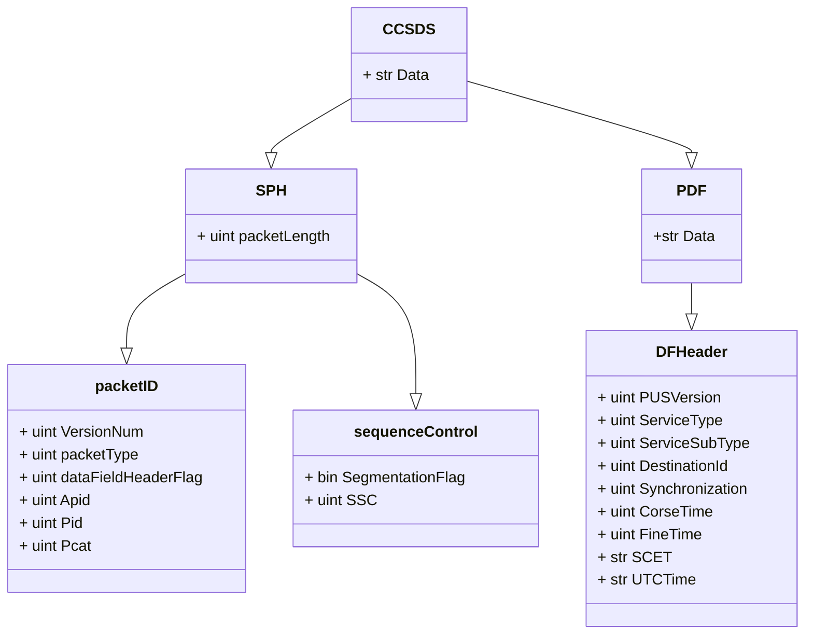

# PyCCSDS

---

PyCCSDS is a library to read a data packet coming from a space mission that follows the Consultative Committee for Space Data Systems (CCSDS) standard

Current version **0.1.0**

[[_TOC_]]

## Installation
```shell
python3 -m pip install Python-CCSDS
```
## Usage
```python
from PyCCSDS.ccsds import CCSDS

dat = CCSDS('BepiColombo',packet)
```
wehre *packet* is a string with the HEX rappresentation of the pachet

## Limitation

## Data Structure

The CCSDS Header is composed by two blocks:
+ the Source Packet Header 
+ the Packet Data Field

The first one il long 48 bits the second one has a varble dimension and structure depending by the type and the content of the packet. in [Figure 1](#figure-1-telemetry-packet) is reported the structure for a Telemetry Packet.

The structure of the CCSDS class follow the structure of the packet header.





#### Figure 1 - Telemetry Packet
